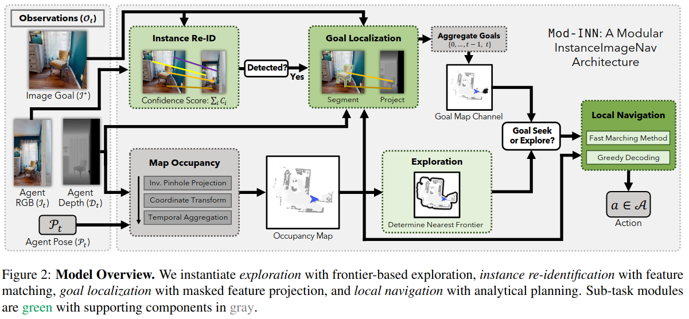

# [Mod-IIN](https://arxiv.org/pdf/2304.01192)

$\texttt{Mod-IIN}$ (https://arxiv.org/pdf/2304.01192) is a modular architecture for image instance navigation, which leverages a vision model "SuperGLUE" for matching the current observation with the goal image. The exploration is handled by FBE, and the method does not require extra fine tuning
<figure>
    
    <figcaption>Fronm the article.</figcaption>
</figure>
